# Badges

Pendant votre stage, vous pourrez obtenir des badges qui reconnaissent certaines attitudes professionnelles importantes dans le domaine du multimédia.

Chaque badge est obtenu lorsque vous décrivez une situation vécue pendant votre stage qui démontre cette attitude.

Le maître de stage validera le badge en se basant sur votre description de la situation.

## Comment obtenir un badge

Pour demander un badge :

Choisissez le badge correspondant à une attitude que vous avez démontrée.

Décrivez à votre enseignant une situation vécue pendant votre stage et expliquez pourquoi vous méritez le badge.   

Vous pouvez demander deux badges par semaine. 

### Badges disponibles 

| Navigateur autonome | Esprit créatif | Oeil de designer | Maître de l'adaptation | Architecte du détail | 
|------|------|------|------|------|
| 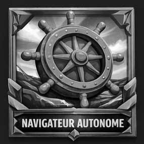 | 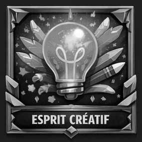 | 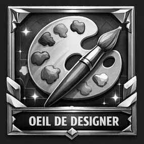 | 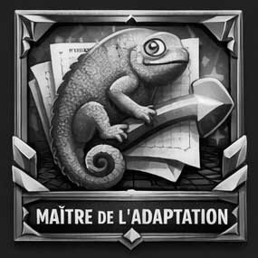 | 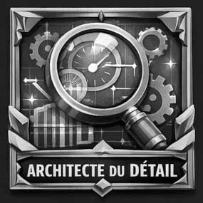 |
|Décrivez une situation où vous avez complété une tâche sans supervision directe.| Décrivez une situation où vous avez proposé une idée ou une solution originale.  |  Décrivez une situation où vous avez amélioré l’aspect visuel d’une production.  | Décrivez une situation où vous avez ajusté votre travail à un changement de demande ou de contrainte. | Décrivez une situation où vous avez vérifié ou corrigé votre travail avant de le remettre.| 

| Explorateur de solutions | Coéquipier exemplaire | Ambassadeur du studio | Maître de l'optimisation | Stratège de production | 
|------|------|------|------|------|
| 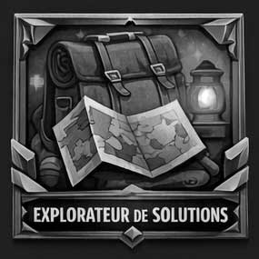 | 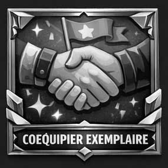 | 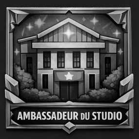 | 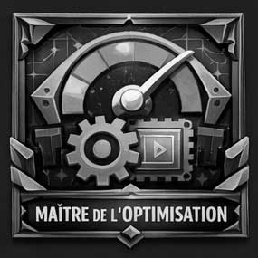 | 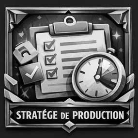 |
|Décrivez une situation où vous avez trouvé une solution à un problème rencontré.| Décrivez une situation où vous avez collaboré avec un membre de l’équipe pour accomplir une tâche.| Décrivez une situation où vous avez adapté votre travail aux besoins ou au contexte de l’entreprise.  | Décrivez une situation où vous avez optimisé un média ou un fichier pour améliorer la performance ou la qualité.| Décrivez une situation où vous avez planifié ou priorisé vos tâches pour respecter un délai.| 

| Gardien de la qualité | Communicateur clair | Moteur de projet | Chercheur de savoir | Professionnel accompli | 
|------|------|------|------|------|
| 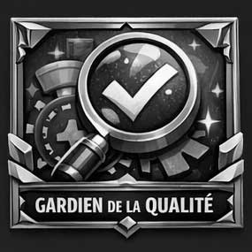 | 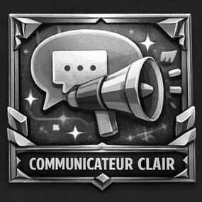 | 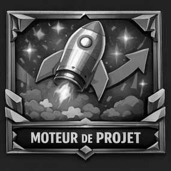 | 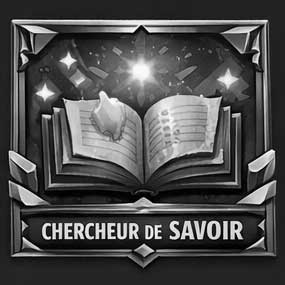 | 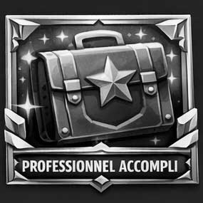 |
|Décrivez une situation où vous avez testé ou validé un résultat avant la livraison.| Décrivez une situation où vous avez expliqué clairement votre travail ou vos idées à un collègue ou un superviseur.| Décrivez une situation où vous avez pris l’initiative de proposer ou d’améliorer quelque chose. | Décrivez une situation où vous avez appris un nouvel outil ou une nouvelle méthode pour réaliser une tâche.| Décrivez une situation où vous avez agi de manière professionnelle face à une difficulté ou une responsabilité. | 

