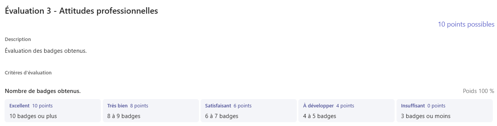
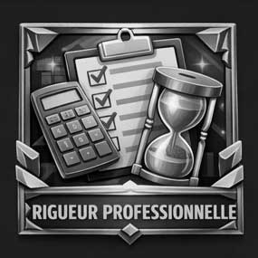
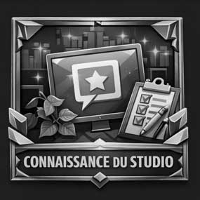

# 🚨 Évaluation 3 - Attitudes professionnelles

## Évaluation par obtention de badges

Pendant votre stage, vous pourrez obtenir des badges qui reconnaissent certaines attitudes professionnelles importantes en multimédia.

Chaque badge est obtenu lorsque vous décrivez une situation vécue pendant votre stage qui démontre une attitude précise.

Vous pouvez demander jusqu'à deux badges par semaine lors de votre rencontre hebdomadaire avec votre enseignant responsable. L'évaluation s'étend de la semaine 1 à 7 de votre stage. C'est à vous de décider à quel moment vous demandez vos badges, en respectant la limite de deux par semaine.    

## Comment obtenir un badge

Pour demander un badge :    

* Choisissez le badge correspondant à une attitude que vous avez démontrée.
* Décrivez à votre enseignant une situation vécue pendant votre stage et expliquez pourquoi vous méritez le badge.
* L'enseignant validera ou non le badge en se basant sur votre description de la situation.
* Lorsque vous obtenez un badge, celui-ci s'affiche maintenant en couleur sur cette page. 

## Grille de correction

Vous avez une possibilité de 15 badges en tout, mais il est possible que certains ne s'appliquent pas à votre stage. Ainsi, seulement 10 sont nécessaires pour obtenir 100% à l'évaluation.  

### Badges disponibles 

| Navigateur autonome | Esprit créatif | Oeil de designer | Maître de l'adaptation | Rigueur professionnelle | 
|------|------|------|------|------|
|  |  |  |  |  |
|Décrivez une situation où vous avez complété une tâche sans supervision directe.| Décrivez une situation où vous avez proposé une idée créative originale qui a contribué à un projet.|  Décrivez une situation où vous avez amélioré l’aspect visuel d’une production.  | Décrivez une situation où vous avez ajusté votre travail à un changement de demande ou de contrainte. | Décrivez une situation où vous avez suivi une procédure ou une méthode de l'entreprise pour réaliser une tâche efficacement.| 

| Explorateur de solutions | Esprit d'équipe | Connaissance du studio | Maître de l'optimisation | Stratège de production | 
|------|------|------|------|------|
|  |  |  |  |  |
|Décrivez une situation où vous avez trouvé une solution à un problème rencontré.| Décrivez une situation où la collaboration avec un collègue a permis d’améliorer un résultat.| Décrivez une situation où vous avez réalisé votre travail en tenant compte de l’identité ou des clients de l'entreprise. | Décrivez une situation où vous avez optimisé un média ou un fichier pour améliorer la performance ou la qualité.| Décrivez une situation où vous avez planifié ou priorisé vos tâches pour respecter un délai.| 

| Gardien de la qualité | Communicateur clair | Moteur de projet | Chercheur de savoir | Professionnel accompli | 
|------|------|------|------|------|
|  |  |  |  |  |
|Décrivez une situation où vous avez testé ou validé un résultat avant la livraison.| Décrivez une situation où vous avez expliqué clairement votre travail ou vos idées à un collègue ou un superviseur.| Décrivez une situation où vous avez pris l’initiative de proposer ou d’améliorer quelque chose. | Décrivez une situation où vous avez appris un nouvel outil ou une nouvelle méthode pour réaliser une tâche.| Décrivez une situation où vous avez agi de manière professionnelle face à une difficulté ou une responsabilité. | 

