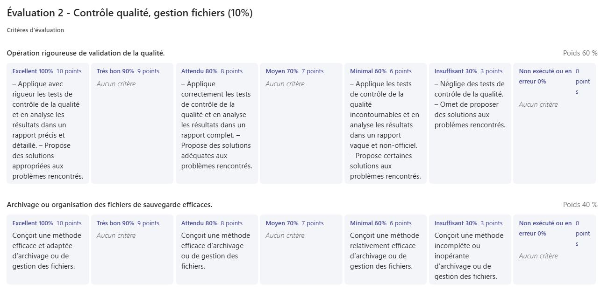

# Semaine 6

## 🚨 Évaluation 2
Au début de la semaine 7, vous serez évalué sur votre archivage et contrôle de la qualité. Assurez-vous d'avoir terminé les sections 1 à 6 de votre journal.     

Voici la grille d'évaluation:     

## Problèmes réels
#### Faites une liste des problèmes qui vous sont arrivés cette semaine. Pour chaque problème énuméré notez la solution que vous avez utilisée.
Exemple:     
### Problème 1
Description: Description du problème technique, créatif ou humain...     
Solutions envisagées: Que pourrait-on faire pour régler ce problème, le limiter ou l'éviter?     

### Problème 2
Description: Description du problème technique, créatif ou humain...     
Solutions envisagées: Que pourrait-on faire pour régler ce problème, le limiter ou l'éviter?     

Continuez la liste au besoin...

## Le produit
#### Si tu as réalisé un ou des projets pendant ton stage qui t'amenait à produire quelque chose, insère un lien permettant de voir la version préliminaire du ou des produits. Tu peux aussi insérer des photos ou vidéos de ton travail!

## Questions complémentaires
### Résumé de la semaine
#### Liste des tâches accomplies cette semaine

#### Liste des équipements ou logiciels utilisés

#### Faits saillants de la semaine

#### Nouvelles choses apprises (méthode de travail, tâche, fonction d'un logiciel, équipement,...)

#### Avez-vous accompli l'ensemble de vos tâches et objectifs pour la semaine? Décrivez    
- [ ] Complètement 
- [ ] Assez
- [ ] Un peu
- [ ] Pas tout à fait    
Description: (Si non, expliquez comment pallier à la siutation).

#### Est-ce que votre mandat ou vos tâches se réalisent selon l'échéancier prévu?    
- [ ] Complètement 
- [ ] Assez
- [ ] Un peu
- [ ] Pas tout à fait    
Description: (Si non, expliquez comment pallier à la siutation). 

### La dynamique du stage
#### Mon degré d'apprentissage grâce à ce stage est:
- [ ] Très élevé
- [ ] Élevé
- [ ] Acceptable
- [ ] Insuffisant    
Commentaires:

####  Je me sens bien intégré.e au personnel du service ou département de mon stage.
- [ ] Très d'accord
- [ ] Assez d'accord
- [ ] Peu d'accord
- [ ] Pas d'accord     
Commentaires:

#### Je suis satisfait de mon stage jusqu'à maintenant.    
- [ ] Complètement 
- [ ] Assez
- [ ] Un peu
- [ ] Pas tout à fait    
Commentaires:

### Qualité et validation du travail accompli
#### Je porte une attention aux détails dans la réalisation de mes tâches. 
- [ ] Très d'accord
- [ ] Assez d'accord
- [ ] Peu d'accord
- [ ] Pas d'accord   
Commentaires:

#### Je propose des solutions appropriées aux problèmes rencontrés: 
- [ ] Très d'accord
- [ ] Assez d'accord
- [ ] Peu d'accord
- [ ] Pas d'accord   
Commentaires:

### Qualité du produit
#### Je réalise un produit cohérent avec le concept et le mandat initial:
- [ ] Très d'accord
- [ ] Assez d'accord
- [ ] Peu d'accord
- [ ] Pas d'accord
- [ ] Ne s'applique pas  

#### Je développe une navigation ou une interactivité conviviale et fluide.
- [ ] Très d'accord
- [ ] Assez d'accord
- [ ] Peu d'accord
- [ ] Pas d'accord
- [ ] Ne s'applique pas

#### Je réalise un produit achevé d'une valeur esthétique réussie. 
- [ ] Très d'accord
- [ ] Assez d'accord
- [ ] Peu d'accord
- [ ] Pas d'accord
- [ ] Ne s'applique pas

#### J'offre une proposition artistique inventive et recherchée. (Si vous avez à faire des proposition artistiques)
- [ ] Très d'accord
- [ ] Assez d'accord
- [ ] Peu d'accord
- [ ] Pas d'accord
- [ ] Ne s'applique pas

### Sens des responsabilités
#### Je démontre qu'on peut me confier une tâche sans inquiétude:
- [ ] Très d'accord
- [ ] Assez d'accord
- [ ] Peu d'accord
- [ ] Pas d'accord   

#### Je respecte les tâches et les mandats confiés:
- [ ] Très d'accord
- [ ] Assez d'accord
- [ ] Peu d'accord
- [ ] Pas d'accord     
Commentaires:    

### Travail d'équipe
#### Je travaille en collaboration avec l'équipe.
- [ ] Très d'accord
- [ ] Assez d'accord
- [ ] Peu d'accord
- [ ] Pas d'accord
- [ ] Ne s'applique pas   

#### J'apporte ma contribution à l'entreprise et je fais avancer le travail par mes suggestions.
- [ ] Très d'accord
- [ ] Assez d'accord
- [ ] Peu d'accord
- [ ] Pas d'accord   

#### Je reconnais et profite de l'expertise des autres membres de l'équipe.
- [ ] Très d'accord
- [ ] Assez d'accord
- [ ] Peu d'accord
- [ ] Pas d'accord
- [ ] Ne s'applique pas   
Commentaires:    
