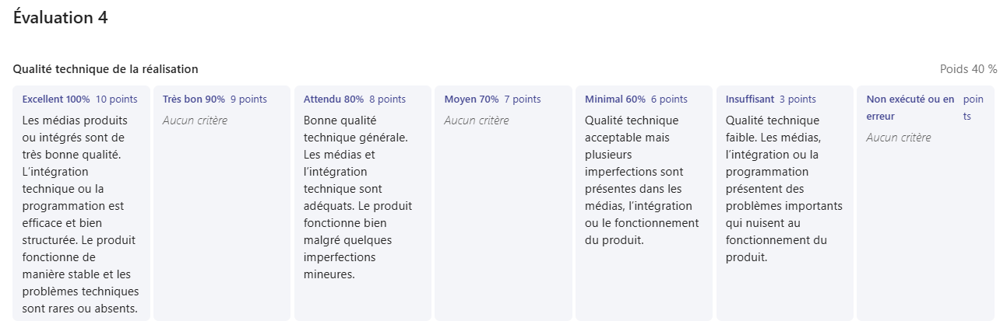
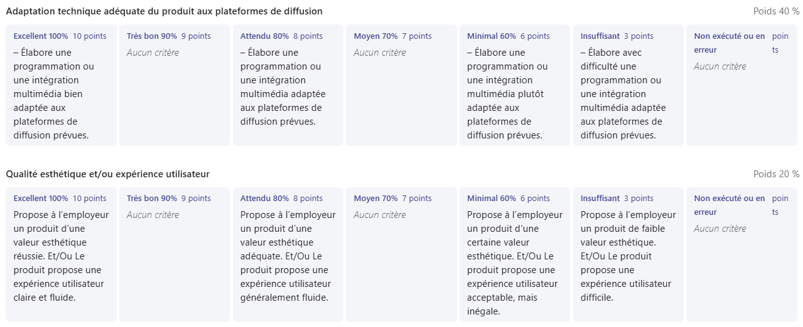

# Semaine 7

## 🚨 Évaluation 4
À la fin de la semaine, vous serez évalué sur votre réalisation en stage. Assurez-vous d'avoir terminé les sections 1 à 7 de votre journal. 

Voici la grille d'évaluation:     

## Le produit
#### Si tu as réalisé un ou des projets pendant ton stage qui t'amenait à produire quelque chose, insère un lien permettant de voir la version finale du ou des produits. Tu peux aussi insérer des photos ou vidéos de ton travail!

## Questions complémentaires
### Résumé de la semaine
#### Liste des tâches accomplies cette semaine

#### Liste des équipements ou logiciels utilisés

#### Faits saillants de la semaine

#### Nouvelles choses apprises (méthode de travail, tâche, fonction d'un logiciel, équipement,...)

#### Avez-vous accompli l'ensemble de vos tâches et objectifs pour la semaine? Décrivez    
- [ ] Complètement 
- [ ] Assez
- [ ] Un peu
- [ ] Pas tout à fait    
Description: (Si non, expliquez comment pallier à la siutation).

#### Est-ce que votre mandat ou vos tâches ont été réalisés selon l'échéancier prévu?    
- [ ] Complètement 
- [ ] Assez
- [ ] Un peu
- [ ] Pas tout à fait    
Description: (Si non, expliquez comment pallier à la siutation). 

#### Je suis satisfait de mon stage.    
- [ ] Complètement 
- [ ] Assez
- [ ] Un peu
- [ ] Pas tout à fait    
Commentaires:

## Autoévaluation finale
#### Ce milieu de travail a répondu à mes attentes initiales:
- [ ] Entièrement
- [ ] Plutôt bien
- [ ] Partiellement
- [ ] Pas tout à fait    
Justifications: Pourquoi vous avez apprécié ou non ce milieu? Ses points forts et ses points faibles. 

### Sens des responsabilités
#### J'ai démontré qu'on pouvait me confier une tâche sans inquiétude.
- [ ] Très d'accord
- [ ] Assez d'accord
- [ ] Peu d'accord
- [ ] Pas d'accord   

#### J'étais débrouillard.e et je faisais preuve d'autonomie.
- [ ] Très d'accord
- [ ] Assez d'accord
- [ ] Peu d'accord
- [ ] Pas d'accord

#### Je vérifiais mon travail et m'assurait qu'il était bien accompli.
- [ ] Très d'accord
- [ ] Assez d'accord
- [ ] Peu d'accord
- [ ] Pas d'accord

#### J'étais assidu.e et ponctuel.le.
- [ ] Très d'accord
- [ ] Assez d'accord
- [ ] Peu d'accord
- [ ] Pas d'accord

#### Je respectais mon horaire de travail.
- [ ] Très d'accord
- [ ] Assez d'accord
- [ ] Peu d'accord
- [ ] Pas d'accord

#### Je respectais les tâches et les mandats confiés.
- [ ] Très d'accord
- [ ] Assez d'accord
- [ ] Peu d'accord
- [ ] Pas d'accord    

#### Commentaires sur le sens des responsabilités: 
Commentaire ici

### Gestion du temps
#### J'évaluais, planifiais et organisais bien mon travail.
- [ ] Très d'accord
- [ ] Assez d'accord
- [ ] Peu d'accord
- [ ] Pas d'accord   

#### Je démontrais de l'initiative pour utiliser mon temps efficacement.
- [ ] Très d'accord
- [ ] Assez d'accord
- [ ] Peu d'accord
- [ ] Pas d'accord

#### Je respectais mes échéanciers et m'acquittais de mes tâches avec efficacité.
- [ ] Très d'accord
- [ ] Assez d'accord
- [ ] Peu d'accord
- [ ] Pas d'accord

#### Commentaires sur votre gestion du temps:   
Commentaire ici

### Capacité d'adaptation
#### J'acceptais les critiques constructives et apportais les correctifs demandés.
- [ ] Très d'accord
- [ ] Assez d'accord
- [ ] Peu d'accord
- [ ] Pas d'accord   

#### Je m'adaptais à la méthode de travail et aux outils utilisés.
- [ ] Très d'accord
- [ ] Assez d'accord
- [ ] Peu d'accord
- [ ] Pas d'accord

#### Je savais m'ajuster devant un imprévu.
- [ ] Très d'accord
- [ ] Assez d'accord
- [ ] Peu d'accord
- [ ] Pas d'accord

#### J'acceptais de réaliser une nouvelle tâche.
- [ ] Très d'accord
- [ ] Assez d'accord
- [ ] Peu d'accord
- [ ] Pas d'accord

#### J'expérimentais et apprenais de nouvelles notions grâce aux connaissances déjà acquises. 
- [ ] Très d'accord
- [ ] Assez d'accord
- [ ] Peu d'accord
- [ ] Pas d'accord

#### Commentaires sur votre capacité d'adaptation:   
Commentaire ici

### Travail d'équipe
#### Je travaillais en collaboration avec l'équipe.
- [ ] Très d'accord
- [ ] Assez d'accord
- [ ] Peu d'accord
- [ ] Pas d'accord
- [ ] Ne s'applique pas

#### J'apportais ma contribution à l'entreprise et faisais avancer le travail par mes suggestions.
- [ ] Très d'accord
- [ ] Assez d'accord
- [ ] Peu d'accord
- [ ] Pas d'accord

#### Je reconnaissais et profitais de l'expertise des autres membres de l'équipe ou de mon superviseur de stage.
- [ ] Très d'accord
- [ ] Assez d'accord
- [ ] Peu d'accord
- [ ] Pas d'accord
- [ ] Ne s'applique pas

#### Commentaires sur le travail d'équipe:   
Commentaire ici

### Relations interpersonnelles
#### J'établissais facilement des contacts avec les gens.
- [ ] Très d'accord
- [ ] Assez d'accord
- [ ] Peu d'accord
- [ ] Pas d'accord
- [ ] Ne s'applique pas

#### Je savais écouter et considérer l'opinion des autres.
- [ ] Très d'accord
- [ ] Assez d'accord
- [ ] Peu d'accord
- [ ] Pas d'accord
- [ ] Ne s'applique pas

#### Je savais faire preuve de discrétion
- [ ] Très d'accord
- [ ] Assez d'accord
- [ ] Peu d'accord
- [ ] Pas d'accord

#### Je me montrais courtois.e.
- [ ] Très d'accord
- [ ] Assez d'accord
- [ ] Peu d'accord
- [ ] Pas d'accord

#### Je m'adaptais bien à la culture de l'entreprise et aux attentes de l'employeur.se.
- [ ] Très d'accord
- [ ] Assez d'accord
- [ ] Peu d'accord
- [ ] Pas d'accord

#### Commentaires sur les relations interpersonnelles:   
Commentaire ici

### Habiletés et compétences développées
#### Qu'avez-vous découvert par ce stage? 
Décrivez.   

#### Ce stage a contribué à augmenter la confiance en mes compétences de façon:
- [ ] Très significative
- [ ] Significative
- [ ] Acceptable
- [ ] Insuffisante

#### J'estime que ce stage m'a permis de développer mes relations professionnelles de façon:
- [ ] Très significative
- [ ] Significative
- [ ] Acceptable
- [ ] Insuffisante

#### Avez-vous accompli le mandat qui était convenu avec l'entreprise? 
- [ ] Oui
- [ ] Non

#### Quelles ont été vos plus grandes forces dans le travail effectué durant le stage? 
Décrivez.   

#### Qu'avez-vous trouvé le plus difficile à réaliser?
Décrivez. 

#### Sur une échelle de 1 à 10, quelle évaluation faites-vous de votre travail dans l'entreprise d'accueil? (1: insuffisant, 10: Exceptionnel)
Chiffre ici.   

#### Que devez-vous améliorer dans votre pratique professionnelle? 
Décrivez. 

#### Comment vous y prendre pour vous améliorer? 
Décrivez. 

#### Dans quelles proportions vos décisions profesionnelles futures seront-elles influencées par cette expérience de stage? 
- [ ] Beaucoup
- [ ] Raisonnablement
- [ ] Partiellement
- [ ] Peu

#### Globalement comment qualifieriez-vous votre expérience de stage? 
- [ ] Très satisfaisante
- [ ] Satisfaisante
- [ ] Partiellement satisfaisante
- [ ] Insatisfaisante

#### Recommanderiez-vous ce lieu de stage à un futur stagiaire? 
- [ ] Oui
- [ ] Non    
Pourquoi?:

#### Commentaires généraux sur le stage:   
Commentaire ici

