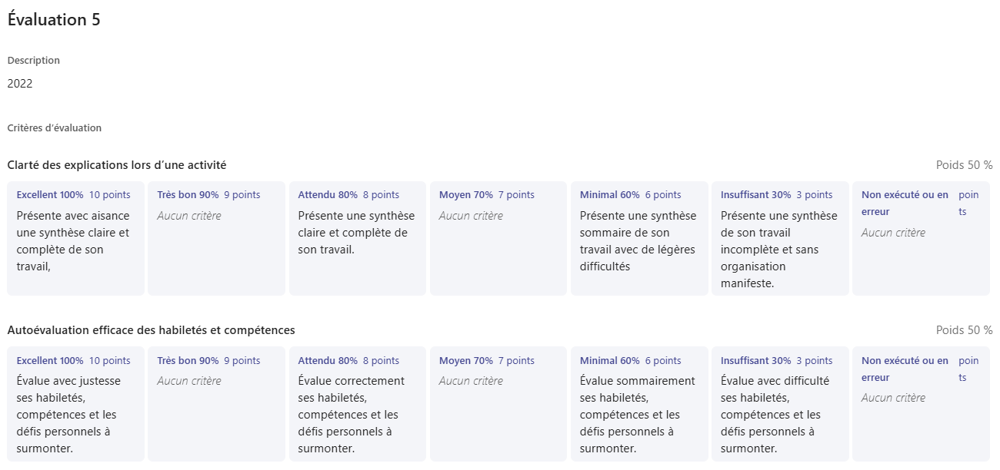

# Semaine 8 
## 🚨 Évaluation 5
À la fin de la semaine, vous serez évalué pendant un retour sur votre stage. L'activité aura lieu le 22 mai de 13h à 16h au grand studio.  

Voici la grille d'évaluation:     

## Consignes pour l'évaluation finale

Pour vous préparer, vous devez aller dans le tableau suivant sur le site Miro: 

[Tableau Miro](https://miro.com/app/board/uXjVGy5b0B8=/?share_link_id=955096827867) 

Vous devez créer une copie de la page nommée carte mentale. 
Modifiez ensuite la note centrale pour y ajouter votre nom, le nom de votre entreprise d'accueil et le domaine de votre stage. 
Autour des post-it bleus vous devez ensuite ajouter d'autres post-it ou des images pour traiter de chacun des points concernant votre stage. Assurez-vous de bien remplir votre tableau puisque nous utiliserons ces informations pendant l'activité. 
Attention à éditer votre carte seulement! 

